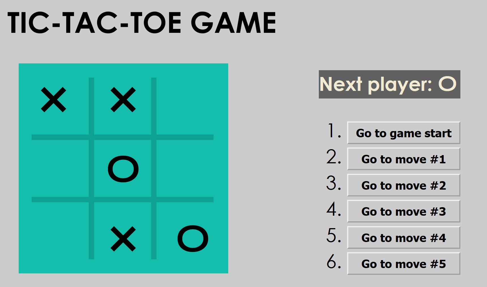

## react-tutorial
I made a simple Tic-Tac-Toe temple accroding to react-tutorial,
This is just a practice about react

### preview


### how to run
1. download node.js
2. npm install

3. run with comment below
```
npm start
```
